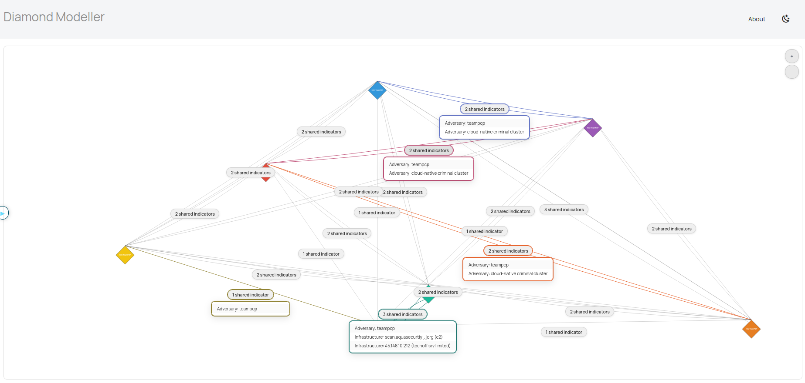
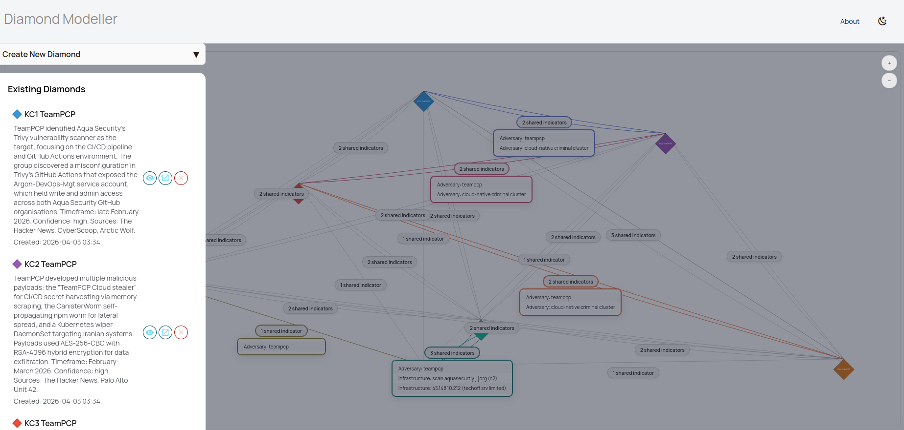

# Diamond Modeller v1.1

**Author:** Albert Davies
**License:** CC BY-NC-SA 4.0 — free for the CTI community, commercial use requires permission

Diamond Modeller is an interactive web application for building, visualising, and analysing [Diamond Model](https://www.activeresponse.org/wp-content/uploads/2013/07/diamond.pdf) graphs for Cyber Threat Intelligence (CTI).

## Why Diamond Modeller?

The real power of Diamond Modeller is as a **backend for agentic orchestration systems**. The included **Agent Skill** (`diamond-modeller-skill/`) gives any AI agent full CRUD access to the Diamond Model graph via a REST API. This means an autonomous agent can ingest threat intelligence reports, decompose them into diamond models mapped to kill chain phases or MITRE ATT&CK tactics, build a connected graph, and generate attribution hypotheses — all programmatically, at scale, without human interaction.

That said, Diamond Modeller is designed to work at three levels:

### 1. Agentic Integration (recommended)

Install the included skill into your orchestration framework. An AI agent can then:

- Convert raw threat intelligence into structured diamond models
- Create one diamond per kill chain phase (`KC1`–`KC7`) or MITRE ATT&CK tactic (`TA0001`–`TA0043`)
- Populate all four vertices with indicators and rich contextual notes
- Auto-link diamonds that share indicators
- Export/import entire analyses as JSON
- Trigger OpenAI-powered attribution hypothesis generation

See `diamond-modeller-skill/SKILL.md` for full instructions, and `diamond-modeller-skill/scripts/diamond_modeller.py` for the Python client.

### 2. Standalone with OpenAI Attribution

Run Diamond Modeller as a standalone web app. Build your graph manually through the UI, then click **Generate hypotheses** to send the full diamond set to an OpenAI-powered analysis pipeline. It produces a downloadable PDF report with ranked attribution hypotheses, confidence levels, and supporting evidence. Requires an OpenAI API key (set via the UI or `.env`).

### 3. Workbench Mode (no API key needed)

Use Diamond Modeller purely as a diamond modelling workbench. Create diamonds, populate vertices with indicators, and let the app auto-generate links where indicators overlap. Export your analysis as JSON or PNG. No OpenAI key required — attribution is entirely optional.

## How It Works

Each **diamond** represents a unit of intrusion activity with four vertices:

| Vertex | What it captures |
|---|---|
| **Adversary** | Threat actor names, aliases, motivations |
| **Victimology** | Targets, organisations, sectors, geographies |
| **Capability** | Tools, malware families, TTPs |
| **Infrastructure** | IPs, domains, email addresses, C2 servers |

Diamonds are placed on an interactive Cytoscape graph. When two diamonds share one or more indicators the app automatically draws a labelled edge between them, making overlaps immediately visible.

## Example: Modelling an Intrusion with Kill Chain Phases

A common pattern is to create one diamond per kill chain phase and populate each with the indicators observed at that stage:

| Diamond (label) | Adversary | Capability | Infrastructure | Victimology |
|---|---|---|---|---|
| **KC1 UNC4736** | UNC4736 | LinkedIn scraping, Google dorking | cdn-update[.]com | ACME Corp |
| **KC3 UNC4736** | UNC4736 | Spear-phishing, macro DOCX | cdn-update[.]com, 198.51.100.12 | ACME Corp |
| **KC4 UNC4736** | UNC4736 | CVE-2024-1234, PowerShell dropper | 198.51.100.12 | ACME Corp |
| **KC6 UNC4736** | UNC4736 | Cobalt Strike beacon | 203.0.113.45, cdn-update[.]com | ACME Corp |
| **KC7 UNC4736** | UNC4736 | Mimikatz, HTTPS exfil | 203.0.113.45, exfil-drop[.]net | ACME Corp |

Because the diamonds share indicators (e.g. `cdn-update[.]com`, `198.51.100.12`, `UNC4736`, `ACME Corp`) the graph automatically links them, producing a connected kill chain visualisation.

The same approach works with MITRE ATT&CK tactics — label diamonds as `TA0043 UNC4736`, `TA0001 UNC4736`, etc.

### Generating Attribution Hypotheses

Once diamonds are populated, click **Generate hypotheses** in the Controls panel. This sends the full set of diamonds to an OpenAI-powered analysis pipeline which:

1. Aggregates all indicators across diamonds.
2. Cross-references known threat actor profiles, TTPs, and infrastructure patterns.
3. Produces a PDF report with ranked attribution hypotheses, confidence levels, and supporting evidence.

The PDF downloads directly in the browser.

## Features

- **Create and edit diamonds** with four vertices (adversary, victimology, capability, infrastructure)
- **Automatic link generation** when diamonds share indicators
- **Interactive graph** (pan, zoom, drag) powered by Cytoscape.js
- **Smart layout** — kill chain (`KC1`–`KC7`) and MITRE ATT&CK (`TA0001`–`TA0043`) diamonds are automatically arranged top-to-bottom in phase/tactic order; overlap count influences spacing
- **Shared indicator badges** — edges between diamonds are summarised as clickable badges; click to expand the full list of shared indicators; multiple badges can be expanded simultaneously
- **Coloured edge highlighting** — expanding a badge colours the connecting lines using the linked diamonds' colours (blended when different); the badge and list borders match
- **Hide / show diamonds** — toggle visibility of individual diamonds from the Existing Diamonds list without deleting them
- **Graph notes** — sticky notes on the graph canvas for annotations
- **Dark mode** toggle in the navbar
- **Export PNG** — high-resolution screenshot of the graph including all overlays (badges, expanded lists, notes)
- **Export / Import graph** — share analysis as JSON files
- **Generate hypotheses** — OpenAI-powered attribution analysis with PDF download
- **Agent Skill** — full REST API client for agentic orchestration
- **About page** — renders this README in the browser

## Agent Skill

The `diamond-modeller-skill/` directory contains everything an AI agent needs to interact with Diamond Modeller:

```text
diamond-modeller-skill/
├── SKILL.md                        # Skill definition and usage instructions
├── scripts/
│   └── diamond_modeller.py          # Python client (DiamondModellerClient)
└── references/
    └── API_REFERENCE.md            # Full REST API endpoint reference
```

The Python client provides dedicated methods for kill chain (`create_kill_chain_diamonds`) and MITRE ATT&CK (`create_mitre_tactic_diamonds`) workflows, with built-in phase/tactic code mappings and label formatting.

## UI Guide

### Navbar

| Element | Description |
|---|---|
| **Diamond Modeller** | App title (left) |
| **About** | Opens this README rendered as HTML |
| **Moon/Sun icon** | Toggles dark mode |

### Left Panel (slide-out drawer)

| Section | Description |
|---|---|
| **Create New Diamond** | Form: label, notes, colour, and collapsible vertex sections. Each vertex accepts indicators one per line. |
| **Existing Diamonds** | List of saved diamonds. Click to edit, pop-out to view details, X to delete. |
| **Create New Note** | Adds a draggable sticky note to the graph canvas. |
| **Controls** | See below. |

### Controls

| Button | Action |
|---|---|
| **Set OpenAI API Key** | Store the key in `.env` for the current session |
| **Export PNG** | Download a high-res PNG of the graph |
| **Export graph** | Download the full analysis as JSON |
| **Import graph** | Upload a previously exported JSON, replacing current data |
| **Generate hypotheses** | Run OpenAI attribution analysis and download a PDF report |
| **Clear all** | Delete all diamonds, edges, and graph notes |

### Existing Diamonds

| Icon | Action |
|---|---|
| **Eye** | Hide/show the diamond on the graph (toggles visibility without deleting) |
| **Pop-out** | View full diamond details in a popup |
| **X** | Delete the diamond permanently |

### Graph Interaction

- **Click a diamond** — opens a detail popup with indicators grouped by vertex
- **Hover a diamond** — shows a "Click to expand" tooltip
- **Click a shared indicators badge** — expands to show all shared indicators between two diamonds; the connecting lines turn coloured to match the linked diamonds
- **Click another badge** — expands independently (previous badges stay open)
- **Click an expanded badge again** — collapses it and resets the line colour
- **Drag a diamond** — repositions it on the canvas
- **Pan** — click and drag the background
- **Zoom** — scroll wheel, or use the +/- buttons

## Example

An example Scattered Spider kill chain analysis ships with the project in `examples/scattered_spider.json`. Import it via the UI (Controls -> Import graph) or the API to see four linked diamonds covering reconnaissance, delivery, installation, and actions on objectives.





## Quick Start

```bash
git clone https://github.com/bertdavies/Diamond-Modeler.git
cd diamond-modeller
python -m venv .venv
source .venv/bin/activate   # Windows: .venv\Scripts\activate
pip install -r requirements.txt
cp .env.example .env        # Optional: add your OpenAI key for attribution
python run.py
```

Then open http://localhost:8000.

## Configuration

| Variable | Required | Default | Description |
|---|---|---|---|
| `DATABASE_URL` | No | `sqlite:///./diamond_modeller.db` | SQLite connection string |
| `OPENAI_API_KEY` | Only for hypothesis generation | — | Set via `.env` or the UI (Controls -> Set OpenAI API Key) |

## REST API Reference

### Pages

| Method | Path | Description |
|---|---|---|
| `GET` | `/` | Redirects to `/graph/` |
| `GET` | `/graph/` | Graph UI page |
| `GET` | `/about` | README rendered as HTML |

### Diamonds

| Method | Path | Description |
|---|---|---|
| `POST` | `/create-diamond` | Create a diamond (form data: label, notes, colour, indicators) |
| `GET` | `/diamonds/` | List/search diamonds (optional `?query=`) |
| `GET` | `/diamonds/{id}` | Diamond summary JSON |
| `GET` | `/diamonds/{id}/details` | Full diamond details JSON (includes indicators per vertex) |
| `GET` | `/diamonds/{id}/edit` | Diamond data pre-filled for editing |
| `PUT` | `/diamonds/{id}` | Update a diamond (form data) |
| `DELETE` | `/diamonds/{id}` | Delete a single diamond |
| `DELETE` | `/diamonds/remove-all/` | Delete all diamonds, vertices, indicators, and edges |

### Graph & Links

| Method | Path | Description |
|---|---|---|
| `GET` | `/graph` | Graph JSON for Cytoscape (`{ elements: { nodes, edges } }`) |
| `POST` | `/links/` | Create a manual link (`{ src_diamond_id, dst_diamond_id, reason }`) |
| `POST` | `/regenerate-links` | Rebuild all automatic links from indicator overlaps |

### Export / Import

| Method | Path | Description |
|---|---|---|
| `GET` | `/api/export-analysis` | Export full analysis as JSON |
| `POST` | `/api/import-analysis` | Import analysis from JSON (replaces current data) |

### Attribution

| Method | Path | Description |
|---|---|---|
| `POST` | `/conduct-attribution` | Run hypothesis generation. Returns PDF on success, JSON on failure. |

### Settings

| Method | Path | Description |
|---|---|---|
| `POST` | `/api/settings/openai-api-key` | Set OpenAI API key (`{ "api_key": "sk-..." }`) |
| `GET` | `/api/settings/openai-api-key` | Check if key is configured (`{ "set": true/false }`) |

## Tech Stack

- **Backend:** FastAPI, SQLModel, SQLite, Alembic
- **Frontend:** Jinja2 templates, JavaScript, Cytoscape.js
- **UI Theme:** [Star Admin 2](https://github.com/BootstrapDash/star-admin2-free-admin-template) by [BootstrapDash](https://www.bootstrapdash.com/) (MIT License)
- **Attribution:** OpenAI SDK, ReportLab
- **Agent Skill:** Python `requests` client

## Database Tables

| Table | Purpose |
|---|---|
| `diamond` | Core diamond records (label, notes, colour, timestamps) |
| `vertex` | One per vertex type per diamond |
| `indicator` | Normalised indicator values with kind classification |
| `vertexindicator` | Many-to-many join between vertices and indicators |
| `edge` | Links between diamonds (automatic or manual) |

## Development

### Migrations

```bash
alembic upgrade head
alembic revision --autogenerate -m "describe change"
```

### Project Layout

```text
.
├── app/                      # FastAPI backend
│   ├── main.py               # Routes and endpoints
│   ├── models.py             # SQLModel / Pydantic models
│   ├── database.py           # Engine and session
│   ├── services.py           # Business logic
│   └── indicators.py         # Indicator normalisation
├── attribution/              # OpenAI-powered hypothesis generation
├── diamond-modeller-skill/    # Agent skill for agentic integration
│   ├── SKILL.md              # Skill definition
│   ├── scripts/              # Python API client
│   └── references/           # API documentation
├── templates/                # Jinja2 HTML templates
├── examples/                 # Example analysis JSON files
├── static/                   # Static assets
├── alembic/                  # Database migrations
├── run.py                    # Dev server entry point
├── requirements.txt
└── README.md
```

## Contributing

Contributions are welcome. Please open an issue or submit a pull request.

## License

This project is licensed under [CC BY-NC-SA 4.0](https://creativecommons.org/licenses/by-nc-sa/4.0/). You are free to share and adapt it for non-commercial purposes, with attribution, under the same license. Commercial use requires prior written permission from the author. See [LICENSE](LICENSE) for details.
